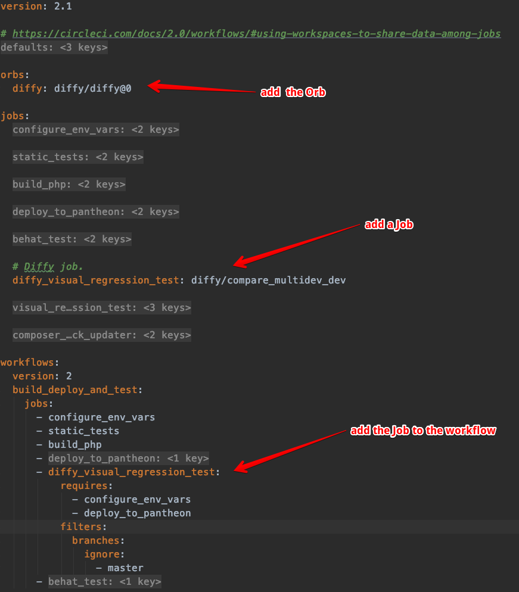

# Diffy CircleCI Orb

Repository contains code for Diffy [CircleCI Orb](https://circleci.com/docs/2.0/orb-intro/).

Orb provides a job to compare Pantheon's DEV environment with Multi Dev. This job is a replacement of
BackstopJS visual regression job in [Pantheon Build Tools workflow](https://pantheon.io/docs/guides/build-tools).

Once you have set up a project by using [Drops 8 workflow](https://github.com/pantheon-systems/example-drops-8-composer) you can use
Diffy to run visual regression testing.

For that you need to configure CircleCI environment variables. Check [documentation page](https://diffy.website/documentation/pantheon-build-tools).

Once variables are configured you need to edit your `.circleci/config.yml` file.

Add an orb (place it at the top of the file)
```yaml
orbs:
   diffy: diffy/diffy@0
```

Then declare Diffy's job in jobs section
```yaml
diffy_visual_regression_test: diffy/compare_multidev_dev
```

And last -- add a new job in workflows (you can remove standard `visual_regression_test` step from workflow too).

```yaml
- diffy_visual_regression_test:
  requires:
    - configure_env_vars
    - deploy_to_pantheon
  filters:
    branches:
      ignore:
        - master
```

Here is how your result config.yml will look like


## Development

To release the orb after making some changes you need to
```
circleci orb validate src/orb.yml
circleci orb publish increment src/orb.yml diffy/diffy patch
```